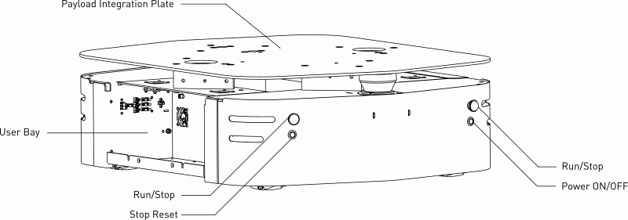

# 🤖 Clearpath Ridgeback R100 — Motion Server & Autonomy Dashboard

A ROS2 Humble package for the **Clearpath Ridgeback R100** omnidirectional robot featuring a compressed RGB-D publisher, Jetson-hosted autonomy stack, LiDAR SLAM, Nav2, VLM room detection, and a web-based dashboard.

> 🔄 Adapted from the [TurtleBot3 AI361-MEX2](https://github.com/SuperMadee/AI361-MEX2) project for holonomic (omnidirectional) control.

---

## 📦 Package Contents

| File | Description |
|---|---|
| 🎯 `srv/Motion.srv` | Custom ROS2 service — supports `linear`, `lateral` (strafe), and `angular` velocity |
| 🏎️ `ridgeback_image_motion/motion_server.py` | Receives service calls → publishes to `/r100_0140/cmd_vel` |
| 📷 `ridgeback_image_motion/image_publisher.py` | Subscribes to RealSense raw images → re-publishes as compressed JPEG |
| 🌐 `ridgeback_image_motion/web_dashboard.py` | FastAPI autonomy dashboard with MJPEG streaming, SLAM map, mission controls, and live status |
| 🚀 `scripts/ridgeback_start.sh` | Builds & runs motion_server + image_publisher |
| 🖥️ `scripts/ridgeback_web.sh` | Builds & runs the Jetson autonomy dashboard stack |

---

## 🔧 Hardware

| Component | Model |
|---|---|
| 🤖 Platform | Clearpath Ridgeback R100 (omnidirectional) |
| 📡 Front LiDAR | Hokuyo UST-10LX (270°, 25Hz) |
| 📷 RGB-D Camera | Intel RealSense D435 |
| 🧭 IMU | Built-in (50Hz) |
| 🎮 Controller | PS4 Bluetooth |

---

## 🆚 Key Differences from TurtleBot Version

| Feature | TurtleBot3 🐢 | Ridgeback 🤖 |
|---|---|---|
| Drive type | Differential (2-wheel) | Omnidirectional (holonomic) |
| Motion service | `linear` + `angular` | `linear` + `lateral` + `angular` |
| Diagonal movement | Rotate → then move forward | True diagonal (strafe + forward simultaneously) |
| Camera source | OpenCV direct capture (RPi Camera) | ROS2 subscriber (RealSense raw → JPEG compress) |
| Teleop left/right | Rotate in place | Strafe sideways |
| Extra controls | — | Separate CCW/CW rotation buttons |
| Keyboard | — | WASD (move) + QE (rotate) + Space (stop) |
| LiDAR visualization | — | Live top-down 2D map with distance coloring |

---

## ⚡ Preliminaries — Turning On the Robot



1. **Power on** — Press the Power ON/OFF on the Ridgeback chassis.
2. **Release E-Stop** (if engaged) — twist the four red Run/Stop button on the robot to release it, then press the **Stop Reset** button.
2. **Check robot light status:**
   - Front WHITE + Rear RED = Ready ✅
   - Flashing RED = E-Stop engaged ❌ → release E-Stop + press Stop Reset button
   - Pulsing ORANGE = Battery is low → connect Ridgeback to charger
   - Pulsing GREEN = Charger is connected → Ridgeback's battery is charging
   - Solid GREEN = Charger is connected → Ridgeback's battery is fully charged
   - Solid RED = MCU is not in contact with the computer ❌ → re-check network configs
3. **Verify ROS is running** — The `clearpath-robot.service` starts automatically on boot. Check with:
   ```bash
   ssh administrator@192.168.131.1 # or ssh administrator@10.158.38.203 if via WiFi
   # Password: c***r***h
   sudo systemctl status clearpath-robot.service
   ```

---

## 🚀 How to Run

This system uses **two machines** — the Ridgeback's onboard PC runs the image publisher and motion fallback service, while the Jetson runs the web dashboard, safety, SLAM, Nav2, frontier exploration, mission orchestration, and VLM calls. Both must be on the same network and use the same `ROS_DOMAIN_ID`.

### 📋 Prerequisites: Cloning the Repository

Both machines need:
- ROS2 Humble sourced (`source /opt/ros/humble/setup.bash`)
- SSH key added to GitHub (since HTTPS password auth is not supported)
- This package cloned and built

Make sure that both machines has an SSH key added to your GitHub account. Then set the remote to use SSH:

```bash
# If cloning fresh
cd ~
git clone git@github.com:SuperMadee/Clearpath_Ridgeback_Motion_Server.git ridgeback

# If already cloned via HTTPS, switch to SSH
cd ~/ridgeback
git remote set-url origin git@github.com:SuperMadee/Clearpath_Ridgeback_Motion_Server.git
```

### 🤖 Step 1: Start the Ridgeback (onboard PC)

**Terminal 1** — SSH into the Ridgeback:
```bash
ssh administrator@192.168.131.1 # or ssh administrator@10.158.39.184 if using WiFi
# Password: c***r***h
```

Pull latest code, build, and run:
```bash
cd ~/ridgeback
git pull
source /opt/ros/humble/setup.bash
export ROS_DOMAIN_ID=0
export RMW_FASTRTPS_USE_SHM=0
export FASTRTPS_DEFAULT_PROFILES_FILE=~/ridgeback/config/fastrtps_ridgeback.xml
colcon build --packages-select ridgeback_image_motion
source install/setup.bash
ros2 run ridgeback_image_motion motion_server.py
```

**Terminal 2** — Open a second SSH session to the Ridgeback:
```bash
ssh administrator@192.168.131.1
cd ~/ridgeback
source /opt/ros/humble/setup.bash
export ROS_DOMAIN_ID=0
export RMW_FASTRTPS_USE_SHM=0
export FASTRTPS_DEFAULT_PROFILES_FILE=~/ridgeback/config/fastrtps_ridgeback.xml
source install/setup.bash
ros2 run ridgeback_image_motion image_publisher.py
```

Or use the start script to run both at once:
```bash
bash ~/ridgeback/scripts/ridgeback_start.sh
```

> 💡 The Clearpath platform nodes (motors, LiDAR, IMU, camera driver) are already running via `clearpath-robot.service` on boot.

---

### 🖥️ Step 2: Start the Jetson (autonomy dashboard)

**Terminal 3** — On the Jetson:
```bash
cd ~/ridgeback
git pull
source /opt/ros/humble/setup.bash
export ROS_DOMAIN_ID=0
export RMW_FASTRTPS_USE_SHM=0
export FASTRTPS_DEFAULT_PROFILES_FILE=~/ridgeback/config/fastrtps_jetson.xml
colcon build --packages-select ridgeback_image_motion
source install/setup.bash
ros2 launch ridgeback_image_motion autonomy.launch.py
```

> 💡 The FastRTPS profiles tell DDS to connect directly via unicast between the Jetson and Ridgeback, since multicast may be blocked on shared networks.

Or use the Jetson autonomy dashboard script:
```bash
bash ~/ridgeback/scripts/ridgeback_web.sh
```

If campus WiFi IPs change, prefer deploy-time DDS profile generation instead
of editing XML by hand:

```bash
export JETSON_IP=<jetson-wifi-ip>
export RIDGEBACK_IP=<ridgeback-wifi-ip>
bash ~/ridgeback/scripts/ridgeback_web.sh
```

This starts:
- `autonomy.launch.py` on the Jetson — safety, watchdog, cmd_vel mux, SLAM, Nav2, frontier exploration, room detection, mission orchestration, and the dashboard

LiDAR SLAM is the default mapping path. Keep `RIDGEBACK_LAUNCH_VSLAM=false`
until the base autonomy stack is stable and you have verified that
`ip route get 192.168.131.1` uses a wired interface, not `wlan0`.

To verify the Jetson is using Ethernet to reach the Ridgeback:

```bash
ip -br addr
ip route get 192.168.131.1
ping -c 3 192.168.131.1
```

---

### 🌐 Step 3: Open the Dashboard

Open a browser on any device connected to the same network:

```
http://<jetson-ip>:8081
```

You should see:
- 📷 Live camera feed (MJPEG from RealSense)
- 🗺️ Live LiDAR top-down map
- 🎮 Omnidirectional teleop controls
- 📊 Real-time velocity, pose, and latency

---

### ✅ Verify Everything Is Connected

On either machine, make sure `ROS_DOMAIN_ID` is set first:
```bash
source /opt/ros/humble/setup.bash
export ROS_DOMAIN_ID=0

# List all active nodes
ros2 node list

# Check image stream is flowing
ros2 topic hz /r100_0140/image/compressed

# Check motion service is available
ros2 service list | grep motion
```

---

## 🕹️ Basic Teleop (Without the Web Controller)

You can drive the Ridgeback directly from the terminal without running the motion server or web controller.

### Keyboard Teleop

```bash
# Install if not already installed
sudo apt-get install ros-humble-teleop-twist-keyboard

# Run keyboard teleop (remapped to the Ridgeback's cmd_vel topic)
ros2 run teleop_twist_keyboard teleop_twist_keyboard \
  --ros-args -r /cmd_vel:=/r100_0140/cmd_vel
```

Use `i` to go forward, `j`/`l` to rotate, `u`/`o` for arcs, and `k` to stop.

### Manual Drive Commands (ros2 topic pub)

```bash
# Forward at 0.2 m/s
ros2 topic pub /r100_0140/cmd_vel geometry_msgs/msg/Twist \
  '{linear: {x: 0.2, y: 0.0, z: 0.0}, angular: {x: 0.0, y: 0.0, z: 0.0}}' -r 10

# Strafe left at 0.1 m/s (holonomic)
ros2 topic pub /r100_0140/cmd_vel geometry_msgs/msg/Twist \
  '{linear: {x: 0.0, y: 0.1, z: 0.0}, angular: {x: 0.0, y: 0.0, z: 0.0}}' -r 10

# Rotate at 0.5 rad/s
ros2 topic pub /r100_0140/cmd_vel geometry_msgs/msg/Twist \
  '{linear: {x: 0.0, y: 0.0, z: 0.0}, angular: {x: 0.0, y: 0.0, z: 0.5}}' -r 10

# Stop
ros2 topic pub /r100_0140/cmd_vel geometry_msgs/msg/Twist \
  '{linear: {x: 0.0, y: 0.0, z: 0.0}, angular: {x: 0.0, y: 0.0, z: 0.0}}' --once
```

### PS4 Controller

The PS4 controller works automatically via `clearpath-robot.service` — no extra setup needed. Just pair via Bluetooth and use the joysticks.

---

## 🎮 Web Dashboard Teleop Controls

### 🖱️ Click Controls (Omnidirectional Pad)

```
  ↖  ▲  ↗       ← Forward + Strafe diagonals
  ◄  ■  ►       ← Strafe left / Stop / Strafe right
  ↙  ▼  ↘       ← Backward + Strafe diagonals

  ↺ CCW   CW ↻  ← Rotation buttons
```

### ⌨️ Keyboard Controls

| Key | Action |
|---|---|
| `W` / `↑` | Forward |
| `S` / `↓` | Backward |
| `A` / `←` | Strafe Left |
| `D` / `→` | Strafe Right |
| `Q` | Rotate CCW |
| `E` | Rotate CW |
| `Space` | 🛑 Emergency Stop |

---

## 📡 ROS2 Topics Used

```
/r100_0140/cmd_vel                          → Drive commands (Twist)
/r100_0140/platform/odom/filtered           → EKF-filtered odometry
/r100_0140/sensors/camera_0/color/image     → RealSense raw RGB
/r100_0140/image/compressed                 → Compressed JPEG (published by image_publisher)
/r100_0140/image/depth_compressed           → Compressed depth PNG (published by image_publisher)
/r100_0140/sensors/lidar2d_0/scan           → Front LiDAR scan (LaserScan, 25Hz)
```

---

## 🗺️ LiDAR Map

The web dashboard includes a **live top-down LiDAR visualization** below the camera feed:

- 🟠 **Robot** shown as orange dot at center
- 🔴🟡🟢 **Scan points** color-coded by distance (red = close, yellow = mid, green = far)
- ⭕ **Range rings** at 1m, 2m, 3m, 4m for scale
- ⬆️ **Forward arrow** shows robot heading
- 📊 **Info bar** with closest obstacle distance and point count
- Updates at **5 Hz** for smooth visualization

---

## 🧩 ROS2 Node Architecture

All nodes running on the system, grouped by function.

### 🔗 Custom Nodes (Image & Motion Pipeline)

These are the custom nodes that bridge the **Ridgeback** and the **Jetson controller**:

| Node | Runs On | Role |
|---|---|---|
| `/image_publisher` | Ridgeback | Subscribes to raw RealSense RGB-D topics and republishes compressed RGB/depth topics with bandwidth-safe defaults |
| `/motion_server` | Ridgeback | Provides the legacy `motion_service` fallback — direct `/r100_0140/cmd_vel` commands should not be the normal autonomy path |
| `/launch_ros_1219` | Ridgeback | ROS2 launch daemon process that started the custom nodes above |
| `/ridgeback_dashboard` | Jetson | FastAPI dashboard node that subscribes to compressed images, odometry, LiDAR, map, mission, and safety status, then publishes teleop through `/cmd_vel_teleop` |

### 🏎️ Drive & Control Nodes

| Node | Role |
|---|---|
| `/r100_0140/controller_manager` | ros2_control manager — loads and manages hardware interfaces and controllers |
| `/r100_0140/platform_velocity_controller` | Converts `cmd_vel` Twist into individual wheel velocity commands for omnidirectional drive |
| `/r100_0140/twist_mux` | Multiplexes multiple Twist sources (joystick, teleop, autonomy) by priority |
| `/r100_0140/twist_server_node` | Clearpath internal twist relay between the mux and the controller |
| `/r100_0140/puma_control` | Manages PUMA motor controller state |
| `/r100_0140/puma_hardware_interface` | ros2_control hardware plugin — talks directly to PUMA motors over CAN bus |
| `/r100_0140/r100_node` | Platform node — communicates with the MCU firmware over CAN (e-stop, lighting, status) |
| `/r100_0140/vcan0_socket_can_receiver` | CAN bus bridge — receives CAN frames from the MCU into ROS2 |
| `/r100_0140/vcan0_socket_can_sender` | CAN bus bridge — sends CAN frames from ROS2 to the MCU |

### 🧭 Localization & State Estimation

| Node | Role |
|---|---|
| `/r100_0140/ekf_node` | Extended Kalman Filter — fuses wheel odometry + IMU → publishes filtered odometry (`/r100_0140/platform/odom/filtered`) |
| `/r100_0140/imu_filter_madgwick` | Madgwick orientation filter — produces stable orientation from raw IMU data |
| `/r100_0140/joint_state_broadcaster` | ros2_control broadcaster — publishes `/joint_states` from the hardware interface |
| `/r100_0140/robot_state_publisher` | Reads URDF + joint states → publishes all TF transforms (`/tf`, `/tf_static`) |

### 📡 Sensor Nodes

| Node | Role |
|---|---|
| `/r100_0140/sensors/camera_0/intel_realsense` | RealSense D435 driver — publishes raw RGB, depth, and pointcloud topics |
| `/r100_0140/sensors/camera_0/image_processing_container` | Composable node container — hosts image processing nodelets (rectification, debayering) |
| `/r100_0140/sensors/lidar2d_0/urg_node` | Hokuyo UST-10LX driver — publishes LaserScan at 25 Hz, 270° FOV |

### 🎮 Teleop & HID Nodes

| Node | Role |
|---|---|
| `/r100_0140/joy_node` | Reads PS4 controller over Bluetooth → publishes `sensor_msgs/Joy` |
| `/r100_0140/teleop_twist_joy_node` | Converts Joy messages into Twist velocity commands for `twist_mux` |

### 🩺 Diagnostics & Status Nodes

| Node | Role |
|---|---|
| `/r100_0140/analyzers` | diagnostic_aggregator — collects diagnostics from all subsystems |
| `/r100_0140/clearpath_diagnostics_updater` | Publishes periodic diagnostic updates for the platform |
| `/r100_0140/battery_state_estimator` | Estimates battery state of charge |
| `/r100_0140/battery_state_control` | Battery monitoring and control |
| `/r100_0140/lighting_node` | Controls the LED light ring (color patterns for status) |
| `/r100_0140/wireless_watcher` | Monitors WiFi connection status and publishes diagnostics |

### 📊 Data Flow Diagram

```
                         RIDGEBACK R100
┌──────────────────────────────────────────────────────────┐
│                                                          │
│  RealSense ──► /intel_realsense ──► raw Image            │
│                                        │                 │
│                                   /image_publisher       │
│                                        │                 │
│                                  CompressedImage         │
│                                        │                 │
│                                        ▼                 │
│              ┌─────────────────────────────────┐         │
│              │        ROS2 DDS Network         │         │
│              │       (Domain ID = 0)           │         │
│              └─────────────────────────────────┘         │
│                                                          │
│  /r100_0140/cmd_vel ──► twist_mux                     │
│                         └──► velocity_ctrl ──► motors  │
│                                                          │
└──────────────────────────────────────────────────────────┘
                           │
                    ROS2 DDS (Domain ID 0)
                           │
┌──────────────────────────┴───────────────────────────────┐
│               JETSON / AUTONOMY DASHBOARD                │
│                                                          │
│  web_dashboard.py (FastAPI + ROS node)                   │
│    ├── subscribes: CompressedImage, Odometry, LaserScan  │
│    ├── publishes: /cmd_vel_teleop + mission commands     │
│    └── serves: Web UI at :8081 (MJPEG + teleop)          │
│                                                          │
└──────────────────────────────────────────────────────────┘
```

#### How It Works

The system runs on **two computers** that communicate over WiFi using **ROS2 DDS** (Domain ID 0) — no broker or central server needed, nodes discover each other automatically.

**Image Pipeline (Ridgeback → Jetson → Browser):**
1. The **RealSense D435** camera captures raw frames
2. The `/intel_realsense` driver node publishes them as `sensor_msgs/Image`
3. `/image_publisher` subscribes, compresses each frame to JPEG, and publishes as `CompressedImage` — this reduces bandwidth for WiFi streaming
4. The **web dashboard** on the Jetson subscribes to the compressed images and streams them as MJPEG video to the browser

**Motion Pipeline (Browser → Jetson → Ridgeback → Wheels):**
1. User presses a key (e.g. `W` for forward) on the web dashboard
2. The **web dashboard** publishes a `Twist` to `/cmd_vel_teleop`
3. The Jetson `cmd_vel_mux` selects safety, Nav2, or teleop and clamps the command
4. The mux publishes the selected command to `/r100_0140/cmd_vel`
5. `velocity_ctrl` converts the Twist into individual wheel speeds
6. **PUMA motor drivers** spin the 4 omnidirectional wheels

**The Closed Loop:** You see what the camera sees → you send a command → the robot moves → the next frame shows the result.

---

## 🛠️ Dependencies

- ROS2 Humble 🐝
- Python 3 🐍
- OpenCV (`python3-opencv`)
- cv_bridge
- FastAPI + Uvicorn (`pip install fastapi uvicorn`)
- NumPy
- OpenAI Python client for OpenAI-compatible VLM endpoints

---

## 📚 Documentation

- [User Manual](https://docs.clearpathrobotics.com/docs_robots/indoor_robots/ridgeback/user_manual_ridgeback/)
- [Tutorials](https://docs.clearpathrobotics.com/docs_robots/indoor_robots/ridgeback/tutorials_ridgeback)
- [Troubleshooting](https://docs.clearpathrobotics.com/docs_robots/indoor_robots/ridgeback/troubleshooting_ridgeback)

---

## 📄 License

Apache-2.0
